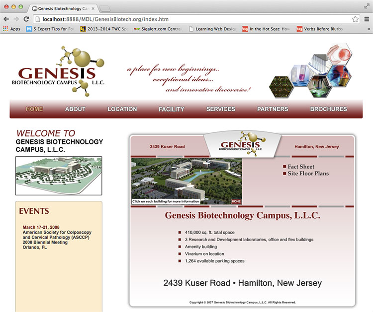
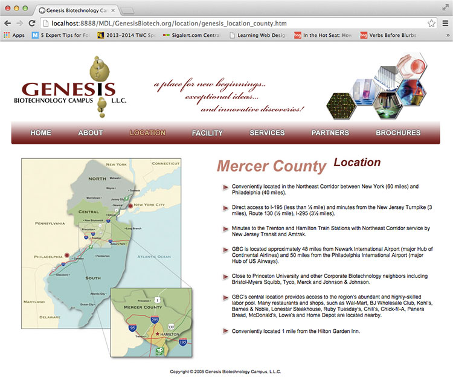
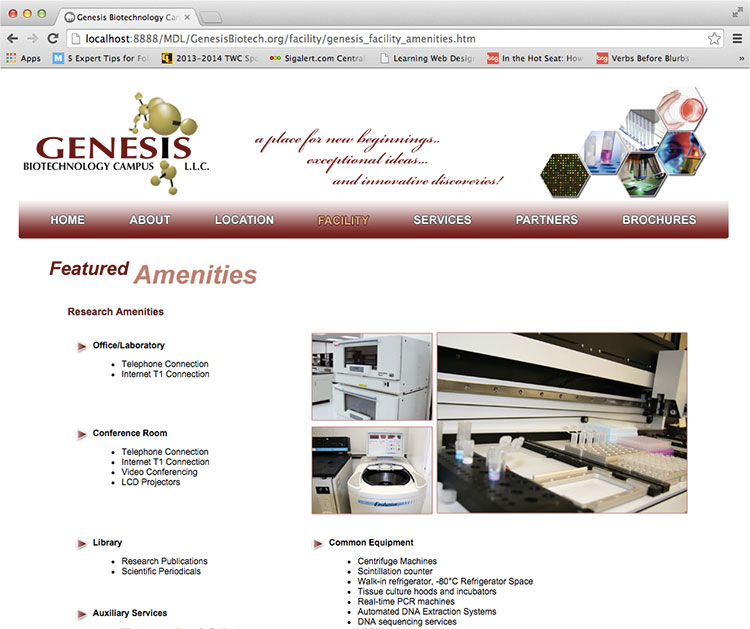

  
`GenesisBiotech.org`  

# Dates:  
2005 - 2008  
# Technologies:  
HTML4, CSS2, Flash
# Description:  
This website was meant to give information about the future research and collaboration between different fields not only in biotechnology but in other fields such as medicine.  It showed different amenities and unique features this research facility will provide and hopes that it will attract other companies to collaborate in this new venture.

I oversaw the full development cycle of this project from design, coding, to maintenance.  
# Screenshots:
  
  
  
